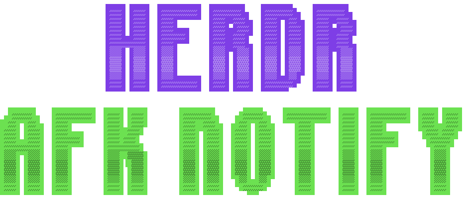

<div align="center">
  <picture>
    <source media="(prefers-color-scheme: dark)" srcset="assets/logo-dark.svg">
    <source media="(prefers-color-scheme: light)" srcset="assets/logo-light.svg">
    
  </picture>
</div>

<div align="center">
  <h3>Phone notifications when an agent needs you, not while you are at the desk</h3>
</div>

<div align="center">
  <a href="LICENSE"></a>
  
  <a href="https://herdr.dev/plugins/"></a>
</div>

<br>

<div align="justify">

A [Herdr](https://github.com/herdrdev/herdr) plugin that sends a push notification through [ntfy](https://ntfy.sh) when one of your coding agents finishes a long turn or stops to ask you something, but only once you have stepped away from the Mac.

> 👀 **Agent needs you · Refine TASK-63**<br>
> Claude is waiting for your answer

> ✅ **Agent done · Implement TASK-174**<br>
> Codex worked for 23 min

## Why this one

- **Every agent, one install.** Herdr already knows whether each pane's agent is working, idle or blocked, so this works for Claude Code, Codex, Pi, OpenCode, Copilot CLI, Antigravity CLI, Grok and every other agent Herdr can see. Nothing goes into each agent's settings, prompts or skills.
- **Only the turns worth hearing about.** A quick reply never notifies. A turn that ran for 5 minutes or more (configurable) does, and so does any question or approval prompt.
- **Silent while you are at the keyboard.** Nothing is sent until the Mac has had no keyboard or mouse input for 3 minutes (configurable). If an agent finishes while you are busy elsewhere, the notification waits for you to leave, and is dropped if you look at that pane first or the agent carries on.
- **No agent output leaves your Mac.** A notification carries the tab name, the agent's name and how long it worked. Never the conversation, the code or the terminal.

## Requirements

- macOS. Idle time comes from `ioreg`.
- [Herdr](https://github.com/herdrdev/herdr) 0.9.0 or newer, with Herdr's integration installed for each agent you use, for example `herdr integration install claude`. `herdr integration status` lists them.
- Node 18 or newer.
- The ntfy app on your phone ([iOS](https://apps.apple.com/app/ntfy/id1625396347), [Android](https://play.google.com/store/apps/details?id=io.heckel.ntfy)).

## Install

```sh
herdr plugin install Argon-Sky/herdr-afk-notify
cat > "$(herdr plugin config-dir argon-sky.afk-notify)/.env" <<'EOF'
NTFY_TOPIC=pick-a-long-unguessable-topic
EOF
```

Then subscribe to the same topic in the ntfy app. Changes to `.env` apply from the next agent event; nothing needs restarting.

| Setting | Default | Meaning |
|---|---|---|
| `NTFY_TOPIC` | required | The ntfy topic to publish to. |
| `NTFY_SERVER` | `https://ntfy.sh` | Your own ntfy server instead of the public one. |
| `NTFY_TOKEN` | none | Bearer token for a server with access control. |
| `AFK_MIN_WORKING_SECONDS` | `300` | The shortest turn that sends **Agent done**. |
| `AFK_AWAY_SECONDS` | `180` | How long the Mac must be idle before anything is sent. `0` sends at once. |

## Uninstall

```sh
herdr plugin uninstall argon-sky.afk-notify
```

## Privacy

- On the public ntfy.sh server, anyone who knows your topic can read it, so pick a long, unguessable one, or run your own server and set `NTFY_TOKEN`.
- Each notification contains the tab name, the agent's name and the turn length, nothing else.
- The plugin keeps a turn start time per pane and a log of delivery outcomes in `~/.local/state/herdr/plugins/argon-sky.afk-notify`. It makes no network request other than the notification itself.

## Troubleshooting

Every agent event is one line in `herdr plugin log list --plugin argon-sky.afk-notify`, and every notification's fate is one line in `~/.local/state/herdr/plugins/argon-sky.afk-notify/deliver.log`: `sent`, `superseded`, `agent is working again`, `seen at the keyboard`, `pane gone`, `gave up waiting` or `failed` with the reason.

- **Nothing ever arrives:** check `deliver.log` for `failed, missing NTFY_TOPIC` or a server error, and that the phone subscribes to the same topic.
- **No Agent done for a long task:** the turn has to run for `AFK_MIN_WORKING_SECONDS` without the agent going idle. If the plugin log shows an agent dipping to idle mid-task, install Herdr's integration for it.
- **Never Agent needs you:** Herdr has to recognise the agent's question or approval prompt. `herdr agent explain <pane>` shows how it reads that pane.
- **A notification arrives a few minutes late:** that is the away-from-keyboard wait. Set `AFK_AWAY_SECONDS=0` to send at once.

## How it works

Herdr runs the plugin's hook on every `pane.agent_status_changed` event.

```text
working              remember when the turn started
idle or done         if the turn ran at least AFK_MIN_WORKING_SECONDS -> start a delivery
blocked              start a delivery
```

A delivery runs in the background so Herdr is never kept waiting. Every 15 seconds it checks the pane through `herdr agent get` and the Mac's idle time, and sends once you have been away for `AFK_AWAY_SECONDS`. It stops without sending when the agent leaves that state, a newer event for the pane replaces it, you are at the keyboard with that pane focused, or 12 hours pass.

The tab name is the Herdr tab's label. A tab Herdr numbered automatically shows the pane's terminal title instead.

## Roadmap

Ideas we are considering. If one of them would be useful to you, or you have another, [open an issue](https://github.com/Argon-Sky/herdr-afk-notify/issues).

- Linux, with idle time from the desktop session.
- Other channels than ntfy.

## Development

```sh
npm test
herdr plugin link "$PWD"
```

Forked from [jjuraszek/herdr-ntfy-notify](https://github.com/jjuraszek/herdr-ntfy-notify), which notifies on every `blocked` and `done` for tabs you switch on by hand. Not affiliated with Herdr or ntfy.

</div>
